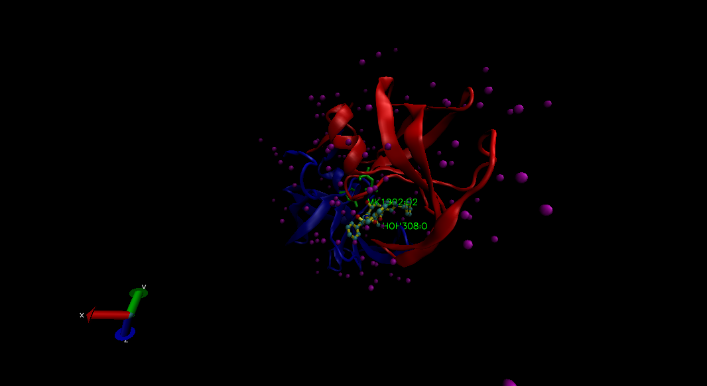
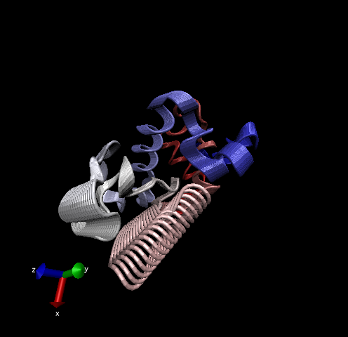
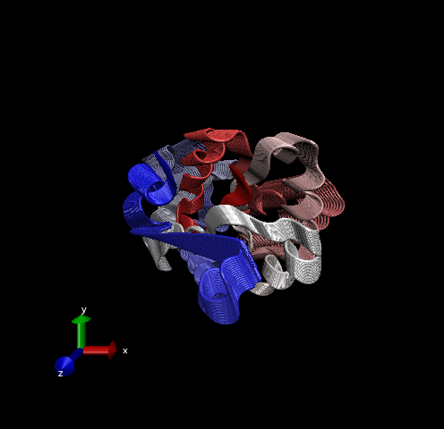

# 1: Introduction to the RCSB Protein Data Bank (PDB)

```{r}
# read in dataset
pdb_data <- read.csv("pdb_data.csv", row.names = 1)
```

> **Q1:** What percentage of structures in the PDB are solved by X-Ray and Electron Microscopy.

### X-Ray = 87.53% and EM = 4.95%

```{r}
round((sum(pdb_data$X.ray))/sum(pdb_data$Total)*100, 2)
```

How about doing this over every method (i.e. coln in the little table)

```{r}
round((colSums(pdb_data) / sum(pdb_data$Total))*100, 2)
```

> **Q2:** What proportion of structures in the PDB are protein?

### 87.35%

```{r}
round((pdb_data[1,7]) /sum(pdb_data$Total)*100, 2)
```

> **Q3:** Type HIV in the PDB website search box on the home page and determine how many HIV-1 protease structures are in the current PDB?

### I got 913 pages of results when I searched "HIV-1 protease"

## The PDB format

Downloaded the pdb format version of 1HSG from PDB

# 2. Visualizing the HIV-1 protease structure

## Getting to know VMD

## Using Atom Selections

> **Q4:** Water molecules normally have 3 atoms. Why do we see just one atom per water molecule in this structure?

### The dataset we downloaded is at 1.9 angstrom resolution which makes the hydrogen atoms too small to be visualized. The red VDW atom we are seeing is an oxygen atom.

> **Q5:** There is a conserved water molecule in the binding site. Can you identify this water molecule? What residue number does this water molecule have (see note below)?

### HOH308:0

> **Optional:** Generate and save a figure clearly showing the two distinct chains of HIV-protease along with the ligand. You might also consider showing the catalytic residues ASP 25 in each chain (we recommend Licorice for these side-chains). Upload this figure to Piazza for some extra credit. [OPTIONAL]



> **Discussion Topic:** Can you think of a way in which indinavir, or even larger ligands and substrates, could enter the binding site? [OPTIONAL]

## Sequence Viewer Extension [OPTIONAL]

> **Q6:** As you have hopefully observed HIV protease is a homodimer (i.e. it is composed of two identical chains). With the aid of the graphic display and the sequence viewer extension can you identify secondary structure elements that are likely to only form in the dimer rather than the monomer? [OPTIONAL]

# 3. Introduction to Bio3D in R

## Reading PDB file data into R

```{r}
library(bio3d)

pdb <- read.pdb("1hel")
pdb
head(pdb$atom)

```

> **Q7:** How many amino acid residues are there in this pdb object?

### 185 amino acid residues

> **Q8:** Name one of the two non-protein residues?

### Water

> **Q9:** How many protein chains are in this structure?

### Two protein chains

Let's do a quick bioinformatics prediction of protein dynamics (flexibility). We'll use the Normal Mode Analysis (NMA) function, a prediction of the conformational variability and intrinsic dynamics of this protein.

```{r}
pdb <- read.pdb("1hel")
modes <- nma(pdb)
plot(modes)
```

Make a movie (trajectory) of this prediction for viewing in VMD using 'mktrj()'.

```{r}
mktrj(modes, file = "nma.pdb")
# Open as a 'new molecule' in VMD then adjust graphic representation and press play.
# In trajectory tab of the graphic representation change the 'now' to '1:100' to render a still image.
```

Add the image from VMD



# 4. Comparative structure analysis of Adenylate Kinase

## Overview
Starting from only one Adk PDB identifier (PDB ID: 1AKE) we will search the entire PDB for related structures using BLAST, fetch, align and superpose the identified structures, perform PCA and finally calculate the normal modes of each individual structure in order to probe for potential differences in structural flexibility.

> **Q10.** Which of the packages above is found only on BioConductor and not CRAN? 

### "msa'

> **Q11.** Which of the above packages is not found on BioConductor or CRAN?: 

### "Grantlab/bio3d-view"

> **Q12.** True or False? Functions from the devtools package can be used to install packages from GitHub and BitBucket?

### TRUE

## Search and retrieve ADK structures

```{r}
# load previously run files to save time
load("myresults.RData")
```


```{r}
# Start by getting a sequence of interest
aa <- get.seq("1AKE_A")
aa
```

> **Q13.** How many amino acids are in this sequence, i.e. how long is this sequence?

### 214 amino acids

Search the PDB database (the main db for exp structures) for sequences like my "aa" sequence.
```{r}
blast <- blast.pdb(aa)
```

```{r}
hits <- plot(blast)
```

Now I have my tops hits from the search of the PDB

```{r}
# Let's look at the structure identifiers
hits$pdb.id
```
Here we download all these similar structures in the PDB and store them on our computer.
```{r}
# Download related PDB files
files <- get.pdb(hits$pdb.id, path = "pdbs", split = TRUE, gzip = TRUE)
```

## Align and superpose structures

We will use the function 'pdbaln()' which requires a MUSCLE download. Downloaded MUSCLE in the 'Terminal' tab using: curl -o "muscle.exe" "https://www.drive5.com/muscle/downloads3.8.31/muscle3.8.31_i86win32.exe"

```{r}
# Align releated PDBs
pdbs <- pdbaln(files, fit = TRUE)
```

```{r}
# Vector containing PDB codes for figure axis
ids <- basename.pdb(pdbs$id)

# Draw schematic alignment
plot(pdbs, labels=ids)
```

Let's save our important results

```{r}
save(blast, hits, aa, files, file = "myresults.RData")

```

## Principle Component Analysis

```{r}
# Perform PCA
pc.xray <- pca(pdbs)
plot(pc.xray)
```

```{r}
# Calculate RMSD
rd <- rmsd(pdbs)

# Structure-based clustering
hc.rd <- hclust(dist(rd))
grps.rd <- cutree(hc.rd, k=3)

plot(pc.xray, 1:2, col="grey50", bg=grps.rd, pch=21, cex=1)
```

# 5. Optional further visualization

```{r}
# Visualize first principal component
pc1 <- mktrj(pc.xray, pc=1, file="pc_1.pdb")
```



```{r}
#Plotting results with ggplot2
library(ggplot2)
library(ggrepel)

df <- data.frame(PC1=pc.xray$z[,1], 
                 PC2=pc.xray$z[,2], 
                 col=as.factor(grps.rd),
                 ids=ids)

p <- ggplot(df) + 
  aes(PC1, PC2, col=col, label=ids) +
  geom_point(size=2) +
  geom_text_repel(max.overlaps = 20) +
  theme(legend.position = "none")
p
```


# 6. Normal mode analysis

```{r}
# NMA of all structures
modes <- nma(pdbs)
plot(modes, pdbs, col=grps.rd)
```


> **Q14.** What do you note about this plot? Are the black and colored lines similar or different? Where do you think they differ most and why?


