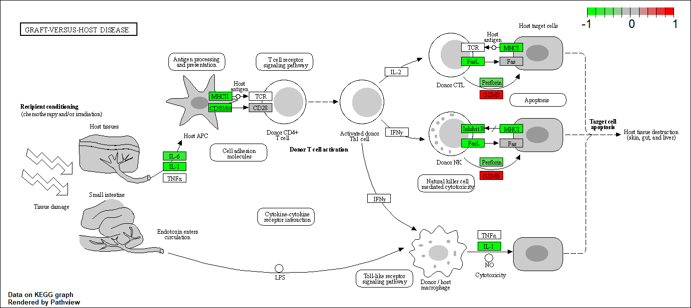

# 1. Bioconductor and DESeq2 setup

## Installed Bioconductor and DEseq2 using:
install.packages("BiocManager")
BiocManager::install()
BiocManager::install("DESeq2")

### To double check the packages were installed use:

```{r message=FALSE, warning=FALSE}
library(BiocManager)
library(DESeq2)
```


# 2. Import countData and colData

```{r}
counts <- read.csv("airway_scaledcounts.csv", row.names = 1)
metadata <- read.csv("airway_metadata.csv")
head(counts)
head(metadata)
```

### Side note: Let's check the corespondence of the metadata and count data setup. (i.e. do the column names in "Counts" match the rownames in "metadata"?)

```{r}
colnames(counts) == metadata$id

# the function all()' will check the whole vector to see if the are all the same value (i.e. "TRUE")

all(colnames(counts) == metadata$id)
```

**Q1.** How many genes are in this dataset?

### There are `r nrow(counts)` genes in this dataset.

```{r}
nrow(counts)
```

**Q2.** How many ‘control’ cell lines do we have?

### There are `r count("control" == metadata$dex)` 'control' cell lines.

```{r}
count("control" == metadata$dex)
```


# 3. Toy differential gene expression

**Note: this analysis is for demonstration only. NEVER do differential expression analysis this way!**

### Compare "control" to "treated"

```{r}
# Find the control samples then calculate the mean counts per gene across these samples:
control <- metadata[metadata[,"dex"]=="control",]
control.counts <- counts[ ,control$id]
control.mean <- rowSums( control.counts )/4 
head(control.mean)
```

**Side-note:** An alternative way to do this same thing using the dplyr package from the tidyverse is shown below.

```{r message=FALSE, warning=FALSE}
library(dplyr)
control <- metadata %>% filter(dex=="control")
control.counts <- counts %>% select(control$id) 
control.mean <- rowSums(control.counts)/4
head(control.mean)
```

**Q3.** How would you make the above code in either approach more robust?

```{r}
# first we need to access all the control columns in our 'metadata' data to access ids.
control.inds <- metadata$dex == "control"
control.ids <- metadata[control.inds,]$id
head(control.ids)
```

```{r}
# Use these ids to access just the control columns of our 'counts' data
head(counts[,control.ids])
colnames(counts[,control.ids]) == control.ids
all(colnames(counts[,control.ids]) == control.ids)
```

```{r}
# get the mean of each control expression

control.mean <- rowMeans(counts[,control.ids])
head(control.mean)
```

**Q4.** Follow the same procedure for the treated samples (i.e. calculate the mean per gene across drug treated samples and assign to a labeled vector called treated.mean)

```{r}
# repeat the above for 'treated'

treated.inds <- metadata$dex == "treated"
treated.ids <- metadata[treated.inds,]$id
head(treated.ids)

head(counts[,treated.ids])
colnames(counts[,treated.ids]) == treated.ids
all(colnames(counts[,treated.ids]) == treated.ids)

treated.mean <- rowMeans(counts[,treated.ids])
head(treated.mean)
```

```{r}
## We will combine our meancount data into a matrix for bookkeeping purposes
meancounts <- data.frame(control.mean,treated.mean)
head(meancounts)
```

**Q5.** Create a scatter plot showing the mean of the treated samples against the mean of the control samples. Your plot should look something like the following.

```{r}
plot(meancounts[,1],meancounts[,2], xlab="Mean Control Expression", ylab="Mean Treated Expression")
```


**Q6.** Try plotting both axes on a log scale. What is the argument to plot() that allows you to do this?

```{r}
# This data suggests in needs to be log transformed
plot(log10(meancounts[,1]), log10(meancounts[,2]), xlab="Mean Control Expression", ylab="Mean Treated Expression")
```

```{r}
# We often use log transformations as they make life much nicer in this world. Here is an example of 'log2()' which represents fold change. positive log2 indicates positive change and negative log2 indicates negative change.

log2(40/20)
```

```{r}
# Now represent differential expression of 'treated.mean' using 'log2()' and add results to a new column in 'meancounts'
meancounts$log2fc <- log2(meancounts[,"treated.mean"]/meancounts[,"control.mean"])
head(meancounts)
```

There are a couple of “weird” results. Namely, the NaN (“not a number”) and -Inf (negative infinity) results.

The NaN is returned when you divide by zero and try to take the log. The -Inf is returned when you try to take the log of zero. It turns out that there are a lot of genes with zero expression. Let’s filter our data to remove these genes. Again inspect your result (and the intermediate steps) to see if things make sense to you

```{r}
# find the zeros in the meancounts dataset
zero.vals <- which(meancounts[,1:2]==0, arr.ind=TRUE)
# create a vector containing all zero values ('unique()' will eliminate duplicate values)
to.rm <- unique(zero.vals[,1])
# remove rows with zeros from the 'meancounts' data
mycounts <- meancounts[-to.rm,]
head(zero.vals)
```

We now have `r nrow(mycounts)` genes remaining.


**Q7.** What is the purpose of the arr.ind argument in the which() function call above? Why would we then take the first column of the output and need to call the unique() function?

### 'arr.ind()' tells 'which()' to return the indices (row and column) of the specific value. We only took the first column because we are deleting rows with zeros and the row numbers are in the first column.


**Q8.** Using the up.ind vector above can you determine how many up regulated genes we have at the greater than 2 fc level? 

```{r}
up.ind <- mycounts$log2fc > 2
sum(up.ind)
```


```{r}
# Determine the % genes that are upregulated (round to 2 sig figs)
round((sum(mycounts$log2fc > +2) / nrow(mycounts))*100,2)
```

### There are `r sum(up.ind)` genes upregulated. That makes `r round((sum(mycounts$log2fc > +2) / nrow(mycounts))*100,2)` percent genes upregulated.

**Q9.** Using the down.ind vector above can you determine how many down regulated genes we have at the greater than 2 fc level? 

```{r}
down.ind <- mycounts$log2fc < (-2)
sum(down.ind)
```

```{r}
# Determine the % genes that are downregulated (round to 2 sig figs)
round((sum(mycounts$log2fc < -2) / nrow(mycounts))*100, 2)
```
### There are `r sum(down.ind)` genes downregulated. That makes `r round((sum(mycounts$log2fc > -2) / nrow(mycounts))*100, 2)` percent genes downregulated.


**Q10.** Do you trust these results? Why or why not?

### I don't trust these results because I don't have access to summary statistics.


# 4. DESeq2 analysis

```{r message=FALSE, warning=FALSE}
# Load DESeq
library(DESeq2)
citation("DESeq2")
```

## Importing data

```{r message=FALSE, warning=FALSE}
dds <- DESeqDataSetFromMatrix(countData=counts,
                              colData=metadata,
                              design=~dex)
dds
```

## DESeq analysis

```{r message=FALSE, warning=FALSE}
dds <- DESeq(dds)
```

```{r}
# Getting results
res <- results(dds)
res
```

# 5. Adding annotation data

We want to add meaningful gene names to our dataset so we can make some sense of what is going on here..

For this we will use two bioconductor packages, one does the work and is called **"Annotation Dbi"**, and the other contains the data we are going to map between and is called **"org.Hs.eg.db"**

```{r message=FALSE, warning=FALSE}
# install packages
# BiocManager::install("AnnotationDbi")
# BiocManager::install("org.Hs.eg.db")
library("AnnotationDbi")
library("org.Hs.eg.db")
```

```{r}
columns(org.Hs.eg.db)
```

**Q11.** Run the mapIds() function two more times to add the Entrez ID and UniProt accession and GENENAME as new columns called res$entrez, res$uniprot and res$genename. **(We started at the end of this day then finished the next class before doing the pathway analysis)**

```{r}
res$symbol <- mapIds(org.Hs.eg.db,
                     keys=row.names(res),
                     keytype="ENSEMBL",
                     column="SYMBOL",
                     multiVals="first")
head(res)
```

# 6. Data Visualization

## A volcano plot

```{r}
# This is a very common data viz of this type of data that does not really look like a volcano
plot(res$log2FoldChange, -log(res$padj), ylab="-Log(P-value)", xlab="Log2(FoldChange)")
# add threshold lines
abline(v=c(-2,2), col="gray", lty=2)
abline(h=-log(0.05), col="gray", lty=2)
# Setup our custom point color vector 
mycols <- rep("gray", nrow(res))
mycols[ abs(res$log2FoldChange) > 2 ]  <- "red" 

inds <- (res$padj < 0.01) & (abs(res$log2FoldChange) > 2 )
mycols[ inds ] <- "blue"

# Volcano plot with custom colors 
plot( res$log2FoldChange,  -log(res$padj), 
 col=mycols, ylab="-Log(P-value)", xlab="Log2(FoldChange)" )

# Cut-off lines
abline(v=c(-2,2), col="gray", lty=2)
abline(h=-log(0.1), col="gray", lty=2)
```


# 7. Pathway analysis

Let's try to bring some biology insight back into this work. For this we will start with KEGG.

```{r message=FALSE, warning=FALSE}
# Install the necessary packages
#BiocManager::install( c("pathview", "gage", "gageData") )

library(pathview)
library(gage)
library(gageData)

data(kegg.sets.hs)

# Examine the first 2 pathways in this kegg set for humans
head(kegg.sets.hs, 2)
```

**Q11 Continued.** Run the mapIds() function two more times to add the Entrez ID and UniProt accession and GENENAME as new columns called res$entrez, res$uniprot and res$genename.

Before we can use KEGG we need to get our gene identifiers in the correct format for KEGG, which is ENTREZ format in this case.

```{r}
res$entrez <- mapIds(org.Hs.eg.db,
                     keys=row.names(res),
                     keytype="ENSEMBL",
                     column="ENTREZID",
                     multiVals="first")
res$genename <- mapIds(org.Hs.eg.db,
                     keys=row.names(res),
                     keytype="ENSEMBL",
                     column="GENENAME",
                     multiVals="first")
head(res)
```

The main gage function requires a named vector of fold changes, where the names of the valuse are Entrez gene IDschange results from DESeq2 results

```{r}
foldchanges <- res$log2FoldChange
head(foldchanges)
```

Assign names to this vector that are the gene IDs that KEGG wants

```{r}
names(foldchanges) <- res$entrez
head(foldchanges)

```

Now we are ready for the **gage()** function

```{r}
keggres = gage(foldchanges, gsets=kegg.sets.hs)
attributes(keggres)
```

```{r}
# Look at the first three down (less) pathways
head(keggres$less, 6)
```

The 'pathview()' function will add our genes to a KEGG pathway as colored entries:

```{r message=FALSE, warning=FALSE}
pathview(gene.data=foldchanges, pathway.id="hsa05310")
```


**Q12.** Can you do the same procedure as above to plot the pathview figures for the top 2 down-regulated pathways?

```{r message=FALSE, warning=FALSE}
library(stringr)
kres.matrix <- as.matrix(keggres$less)
kres.rnames <- rownames(kres.matrix)
kres.splitnames <- str_split_fixed(kres.rnames, " ", 2)
pathview(gene.data=foldchanges, pathway.id=kres.splitnames[1:2,1])
```




