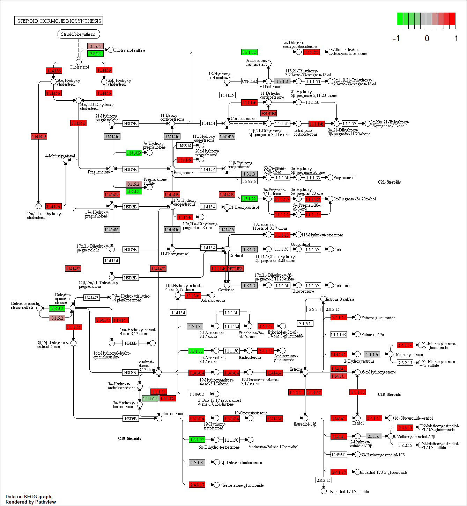
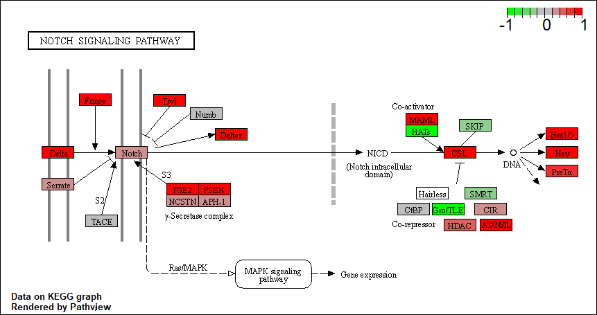

## Background Notes:

### 1. Data import
### 2. PCA (for quality control)
### 3. DESeq analysis

# Section 1. Differential Expression Analysis

## 1. Data import

```{r}
# Load DESeq and our files
library(DESeq2)
metaFile <- "GSE37704_metadata.csv"
countFile <- "GSE37704_featurecounts.csv"

# Import metadata and take a peak
colData = read.csv(metaFile, row.names=1)
head(colData)

# Import countdata
countData = read.csv(countFile, row.names=1)
head(countData)
```

Complete the code below to remove the troublesome first column from countData

```{r}
countmatrix <- as.matrix(countData[,2:7])
head(countmatrix)
```

Complete the code below to filter countData to exclude genes (i.e. rows) where we have 0 read count across all samples (i.e. columns).

Tip: What will rowSums() of countData return and how could you use it in this context?

```{r}
# Filter count data where you have 0 read count across all samples.
countmatrix = countmatrix[rowSums(countmatrix) != 0, ]
head(countmatrix)
```

There are `r nrow(countmatrix)` genes left in the countData.

## 2. PCA (for quality control)

### Our sample-level QC allows us to see how well our replicates cluster together, as well as, observe whether our experimental condition represents the major source of variation in the data. Performing sample-level QC can also identify any sample outliers, which may need to be explored further to determine whether they need to be removed prior to DE analysis.

```{r}
# Perform PCA analysis on transformed data
countpca <- prcomp(t(countmatrix), scale = T)
head(countpca$x)

# plot transformed PCA
plot(countpca$x[,1:2])

```


## 3. DESeq analysis

```{r}
dds = DESeqDataSetFromMatrix(countData=countmatrix,
                             colData=colData,
                             design=~condition)
dds = DESeq(dds)
res <- results(dds)
```

Call the summary() function on your results to get a sense of how many genes are up or down-regulated at the default 0.1 p-value cutoff.

```{r}
head(res)
```


```{r}
plot( res$log2FoldChange, -log(res$padj) )

```

Improve this plot by completing the below code, which adds color and axis labels

```{r}
# Make a color vector for all genes
mycols <- rep("gray", nrow(res))

# Color red the genes with absolute fold change above 2
mycols[ abs(res$log2FoldChange) > 2 ] <- "red"

# Color blue those with adjusted p-value less than 0.01
#  and absolute fold change more than 2
inds <- (res$pvalue < 0.01) & (abs(res$log2FoldChange) > 2 )
mycols[ inds ] <- "blue"

plot( res$log2FoldChange, -log(res$padj), col=mycols, xlab="Log2(FoldChange)", ylab="-Log(P-value)" )
```

Use the mapIDs() function multiple times to add SYMBOL, ENTREZID and GENENAME annotation to our results by completing the code below.

```{r}
library("AnnotationDbi")
library("org.Hs.eg.db")

columns(org.Hs.eg.db)
```


```{r}
res$symbol = mapIds(org.Hs.eg.db,
                    keys=rownames(res), 
                    keytype="ENSEMBL",
                    column="SYMBOL",
                    multiVals="first")

res$entrez = mapIds(org.Hs.eg.db,
                    keys=rownames(res),
                    keytype="ENSEMBL",
                    column="ENTREZID",
                    multiVals="first")

res$name =   mapIds(org.Hs.eg.db,
                    keys=row.names(res),
                    keytype="ENSEMBL",
                    column="GENENAME",
                    multiVals="first")

head(res, 10)
```

Finally for this section let's reorder these results by adjusted p-value and save them to a CSV file in your current project directory.

```{r}
res = res[order(res$pvalue),]
write.csv(res, file="deseq_results.csv")
```

# Section 2. Pathway Analysis

The gageData package has pre-compiled databases mapping genes to KEGG pathways and GO terms for common organisms. kegg.sets.hs is a named list of 229 elements. Each element is a character vector of member gene Entrez IDs for a single KEGG pathway. (See also go.sets.hs). The sigmet.idx.hs is an index of numbers of signaling and metabolic pathways in kegg.set.gs. In other words, KEGG pathway include other types of pathway definitions, like "Global Map" and "Human Diseases", which may be undesirable in a particular pathway analysis. Therefore, kegg.sets.hs[sigmet.idx.hs] gives you the "cleaner" gene sets of signaling and metabolic pathways only.

```{r}
# First we need to do our one time install of these required bioconductor packages:
# BiocManager::install( c("pathview", "gage", "gageData") )

# For old vesrsions of R only (R < 3.5.0)!
#source("http://bioconductor.org/biocLite.R")
#biocLite( c("pathview", "gage", "gageData") )
library(pathview)
library(gage)
library(gageData)
```

```{r}
# Import data:
data(kegg.sets.hs)
data(sigmet.idx.hs)

# Focus on signaling and metabolic pathways only
kegg.sets.hs = kegg.sets.hs[sigmet.idx.hs]

# Examine the first 3 pathways
head(kegg.sets.hs, 3)
```

The main gage() function requires a named vector of fold changes, where the names of the values are the Entrez gene IDs.

Note that we used the mapIDs() function above to obtain Entrez gene IDs (stored in res$entrez) and we have the fold change results from DESeq2 analysis (stored in res$log2FoldChange).

```{r}
foldchanges = res$log2FoldChange
names(foldchanges) = res$entrez
head(foldchanges)

# Now let's run the 'gage()' analysis:
keggres = gage(foldchanges, gsets=kegg.sets.hs)

attributes(keggres)
```

```{r}
# Look at the first few down (less) pathways
head(keggres$less)

# Let's try out the pathview() function from the pathview package to make a pathway plot with our RNA-Seq expression results shown in color.

pathview(gene.data=foldchanges, pathway.id="hsa04110")
```

```{r}
## Focus on top 5 upregulated pathways here for demo purposes only
keggrespathways <- rownames(keggres$greater)[1:5]

# Extract the 8 character long IDs part of each string
keggresids = substr(keggrespathways, start=1, stop=8)
keggresids
```

```{r}
pathview(gene.data=foldchanges, pathway.id=keggresids, species="hsa")
```







Can you do the same procedure as above to plot the pathview figures for the top 5 down-regulated pathways?

```{r}
## Focus on top 5 downregulated pathways
keggrespathways2 <- rownames(keggres$less)[1:5]

# Extract the 8 character long IDs part of each string
keggresids2 = substr(keggrespathways2, start=1, stop=8)
keggresids2
```

```{r}
pathview(gene.data=foldchanges, pathway.id=keggresids2, species="hsa")
```


# Section 3. Gene Ontology (GO)

```{r}
# Import data:
data(go.sets.hs)
data(go.subs.hs)

# Focus on Biological Process subset of GO
gobpsets = go.sets.hs[go.subs.hs$BP]

gobpres = gage(foldchanges, gsets=gobpsets, same.dir=TRUE)

lapply(gobpres, head)
```

# Section 4. Reactome Analysis

Reactome is database consisting of biological molecules and their relation to pathways and processes. Reactome, such as many other tools, has an online software available (https://reactome.org/) and R package available (https://bioconductor.org/packages/release/bioc/html/ReactomePA.html).

If you would like more information, the documentation is available here: https://reactome.org/user/guide

Let's now conduct over-representation enrichment analysis and pathway-topology analysis with Reactome using the previous list of significant genes generated from our differential expression results above.

```{r}
# First, Using R, output the list of significant genes at the 0.05 level as a plain text file:
sig_genes <- res[res$padj <= 0.05 & !is.na(res$padj), "symbol"]
print(paste("Total number of significant genes:", length(sig_genes)))
write.table(sig_genes, file="significant_genes.txt", row.names=FALSE, col.names=FALSE, quote=FALSE)
```

Then, to perform pathway analysis online go to the Reactome website (https://reactome.org/PathwayBrowser/#TOOL=AT). Select “choose file” to upload your significant gene list. Then, select the parameters “Project to Humans”, then click “Analyze”.


What pathway has the most significant “Entities p-value”? Do the most significant pathways listed match your previous KEGG results? What factors could cause differences between the two methods?

### The pathway with the most significant "Entities p-value" is the endosomal/vacuolar pathway


