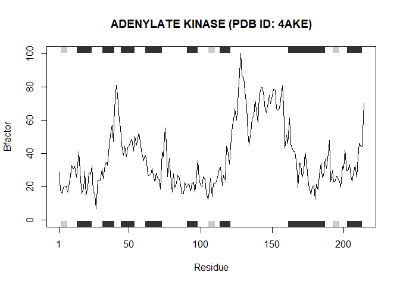
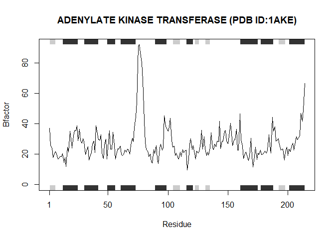
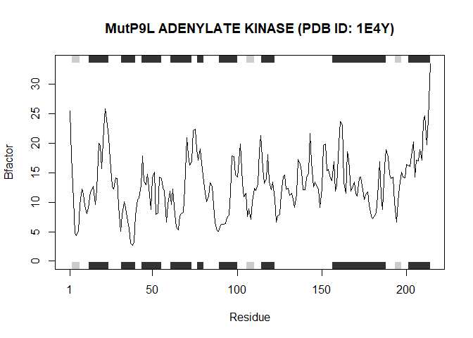
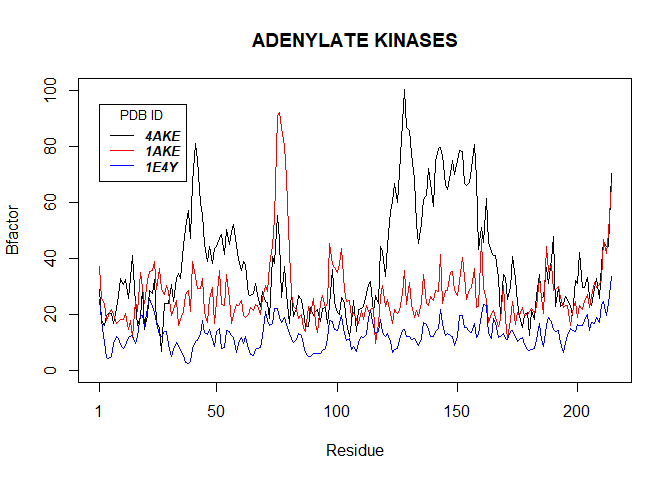

BGGN213: Lab 6 Supplement
================
Taylor Darby
10/20/2021

# This is the supplement to Lab 6: R Functions

## Section 1: Improving analysis code by writing functions

### **A.** Improve this regular R code by abstracting the main activities in your own new function. (Note: we will go through this example together in the formal lecture.)

> The main steps should entail running through the code to see if it
> works,…

``` r
# I had to make some edits in the code to get it to work correctly (i.e. store the 5 appropriate data and values in the global environment). This is not efficient.

df <- data.frame(a=1:10, b=seq(200,400,length=10),c=11:20,d=NA)
df$a <- (df$a - min(df$a)) / (max(df$a) - min(df$a))
df$b <- (df$b - min(df$b)) / (max(df$b) - min(df$b))
df$c <- (df$c - min(df$c)) / (max(df$c) - min(df$c))
df$d <- (df$d - min(df$d)) / (max(df$d) - min(df$d))
df$a
```

    ##  [1] 0.0000000 0.1111111 0.2222222 0.3333333 0.4444444 0.5555556 0.6666667
    ##  [8] 0.7777778 0.8888889 1.0000000

> **A. (continued)** … simplifying to a core working code snippet,

``` r
x <- df$a
x2 <- (x - min(x)) / (max(x) - min(x))
x2
```

    ##  [1] 0.0000000 0.1111111 0.2222222 0.3333333 0.4444444 0.5555556 0.6666667
    ##  [8] 0.7777778 0.8888889 1.0000000

> **A. (continued)** … reducing any calculation duplication,

``` r
# Setting 'min(x)' and 'max(x)' as "range" functions will reduce calculation duplication
x <- df$a
rng <- range(x)
# where the function ends up looking like this...
x2 <- (x - rng[1]) / (rng[2] - rng[1])
x2
```

    ##  [1] 0.0000000 0.1111111 0.2222222 0.3333333 0.4444444 0.5555556 0.6666667
    ##  [8] 0.7777778 0.8888889 1.0000000

> **A. (continued)** … and finally transferring your new streamlined
> code into a more useful function for you.

``` r
# This code streamlined the previous code into a more useful function that accounts for 'NA' values.
rescale <- function(x) {
  rng <- range(x, na.rm=TRUE)
  (x - rng[1]) / (rng[2] - rng[1])
}
# Example showing function is functional
rescale(1:10)
```

    ##  [1] 0.0000000 0.1111111 0.2222222 0.3333333 0.4444444 0.5555556 0.6666667
    ##  [8] 0.7777778 0.8888889 1.0000000

``` r
# Now that we know this function works we can save the function either as an R file and source it each time, or we can extract the function ('Code' -> 'Extract Function')
```

### **B.** Next improve the below example code for the analysis of protein drug interactions by abstracting the main activities in your own new function. Then answer questions 1 to 6 below. It is recommended that you start a new Project in RStudio in a new directory and then install the bio3d package noted in the R code below (N.B. you can use the command ‘install.packages(“bio3d”)’ or the RStudio interface to do this).

> **Installing the bio3d package** (Note: This code is not within a
> “code chunk” to avoid installing packages multiple times)
> ‘install.packages(“bio3d”)’

> **B. (continued)** … Then run through the code to see if it works, fix
> any copy/paste errors before simplifying to a core working code
> snippet…

``` r
library(bio3d)
# Overall Goal: Can you improve this analysis code?
# First corrected any copy/paste errors
s1 <- read.pdb("4AKE") # kinase with drug
```

    ##   Note: Accessing on-line PDB file

``` r
s2 <- read.pdb("1AKE") # kinase no drug
```

    ##   Note: Accessing on-line PDB file
    ##    PDB has ALT records, taking A only, rm.alt=TRUE

``` r
s3 <- read.pdb("1E4Y") # kinase with drug
```

    ##   Note: Accessing on-line PDB file

``` r
s1.chainA <- trim.pdb(s1, chain="A", elety="CA")
s2.chainA <- trim.pdb(s2, chain="A", elety="CA")
s3.chainA <- trim.pdb(s3, chain="A", elety="CA")
s1.b <- s1.chainA$atom$b
s2.b <- s2.chainA$atom$b
s3.b <- s3.chainA$atom$b

# Then plotted each dataset individually and added titles
plotb3(s1.b, sse=s1.chainA, typ="l", ylab="Bfactor", main = "ADENYLATE KINASE (PDB ID: 4AKE)")
```

<!-- -->

``` r
plotb3(s2.b, sse=s2.chainA, typ="l", ylab="Bfactor", main = "ADENYLATE KINASE TRANSFERASE (PDB ID:1AKE)")
```

<!-- -->

``` r
plotb3(s3.b, sse=s3.chainA, typ="l", ylab="Bfactor", main = "MutP9L ADENYLATE KINASE (PDB ID: 1E4Y)")
```

<!-- -->

> **B. (continued)** … simplifying to a core working code snippet,
> reducing any calculation duplication, …

``` r
# First, I reduced the amount of calculations by inserting 'read.pdb()' directly into the 'trim.pdb()' function
s1.chainA <- trim.pdb((read.pdb("4AKE")), chain="A", elety="CA")
```

    ##   Note: Accessing on-line PDB file

    ## Warning in get.pdb(file, path = tempdir(), verbose = FALSE): C:
    ## \Users\colta\AppData\Local\Temp\RtmpIzDV4o/4AKE.pdb exists. Skipping download

``` r
s1.b <- s1.chainA$atom$b
plotb3(s1.b, sse=s1.chainA, typ="l", ylab="Bfactor", main = "ADENYLATE KINASE (PDB ID: 4AKE)")
```

<!-- -->

> **B. (continued)** … and finally transferring it into a more useful
> function for you.

``` r
# I transferred the main part of the function (didn't include plotting) into a more useful function named 'lab6' where "x" was the input PDB ID and the output was 'atom$b' of 'chainA'
lab6 <- function(x) {
  chainA <- trim.pdb((read.pdb(x)), chain="A", elety="CA")
  chainA$atom$b
}
```

``` r
# Then I plotted each PDB ID onto one plot
plotb3(lab6("4AKE"), typ="l", ylab="Bfactor", main = "ADENYLATE KINASES")
```

    ##   Note: Accessing on-line PDB file

    ## Warning in get.pdb(file, path = tempdir(), verbose = FALSE): C:
    ## \Users\colta\AppData\Local\Temp\RtmpIzDV4o/4AKE.pdb exists. Skipping download

``` r
lines(lab6("1AKE"), col="red")
```

    ##   Note: Accessing on-line PDB file

    ## Warning in get.pdb(file, path = tempdir(), verbose = FALSE): C:
    ## \Users\colta\AppData\Local\Temp\RtmpIzDV4o/1AKE.pdb exists. Skipping download

    ##    PDB has ALT records, taking A only, rm.alt=TRUE

``` r
lines(lab6("1E4Y"), col="blue")
```

    ##   Note: Accessing on-line PDB file

    ## Warning in get.pdb(file, path = tempdir(), verbose = FALSE): C:
    ## \Users\colta\AppData\Local\Temp\RtmpIzDV4o/1E4Y.pdb exists. Skipping download

``` r
# Then added a legend
legend(1, 95, legend=c("4AKE", "1AKE", "1E4Y"),
       col=c("black", "red", "blue"), lty = 1, cex=0.8,
       title="PDB ID", text.font=4)
```

<!-- -->

> **Q1.** What type of object is returned from the read.pdb() function?

‘read.pdb()’ retrieves the specified file from Protein Data Bank

> **Q2.** What does the trim.pdb() function do?

‘trim.pdb()’ retrieves a specified subset of atoms from the original
Protein Data Bank file

> **Q3.** What input parameter would turn off the marginal black and
> grey rectangles in the plots and what do they represent in this case?

Taking out ‘sse=a.chainA’ turns off the marginal black and grey
rectangles. These rectangles represent secondary structures.

> **Q4.** What would be a better plot to compare across the different
> proteins?

PCA with a cluster diagram would probably be the best because you could
easily visualize and quantify relationships between multiple parameters.

> **Q5.** Which proteins are more similar to each other in their
> B-factor trends. How could you quantify this?

``` r
hc <- hclust( dist( rbind(s1.b, s2.b, s3.b) ) )
plot(hc)
```

<!-- -->

**Q5 Answer:** “1AKE” (i.e. “s2.b”, and red) and “1E4Y” (i.e. “s3.b”,
and blue) are more similar to each other in their B-factor trends.

> **Q6.** How would you generalize the original code above to work with
> any set of input protein structures?

I already did. Using my function ‘lab6()’ you just put the PDB ID into
the parethesis within quotes.
