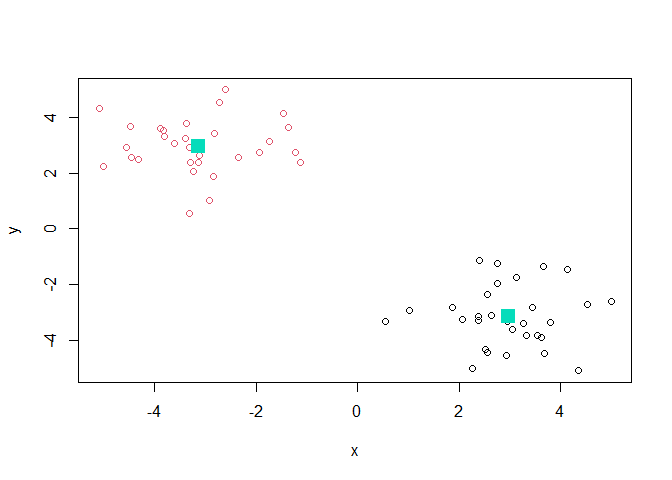
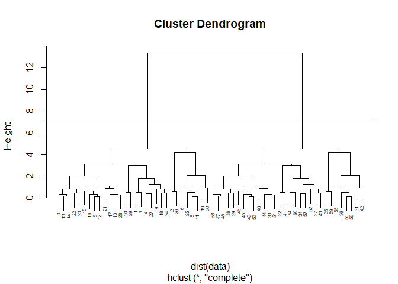
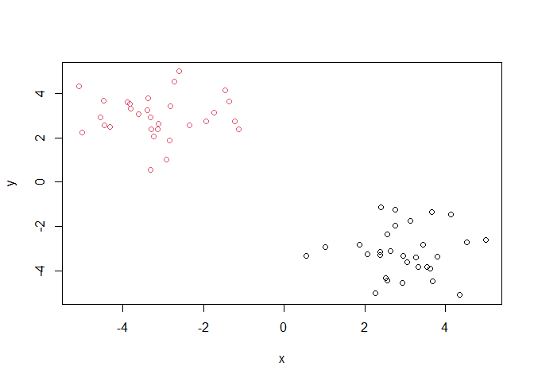
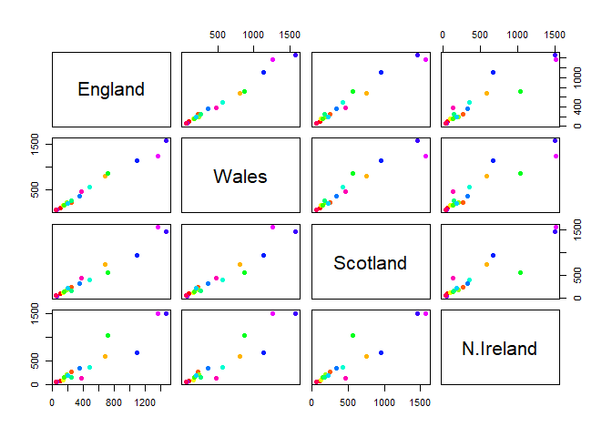
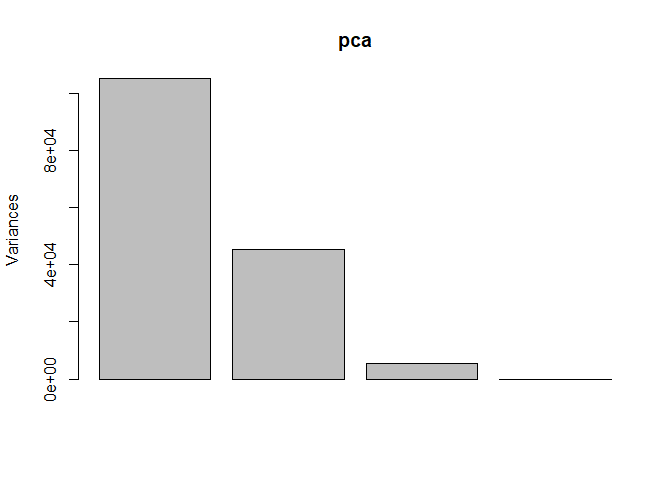
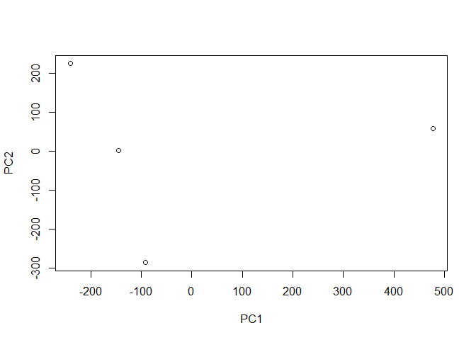
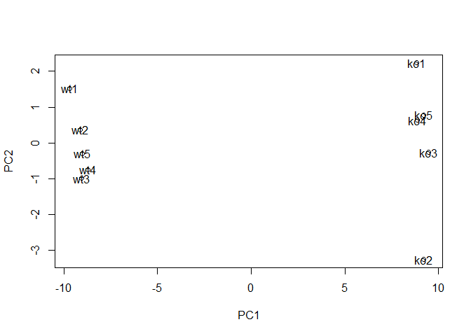

Lab 8: Machine Learning 1
================
Taylor Darby
10/22/2021

# Clustering methods

Kmeans clustering in R is done with the “kmeans()” function. Here we
makeup some data to test and learn with.

``` r
# 'rnorm' provides a random dataset distributed normally, and specifying x and y sets the number of rows and the distance between the two columns.
tmp <- c(rnorm(30, 3), rnorm(30, -3))

# 'cbind' binds the data in the columns together
data <- cbind(x=tmp, y=rev(tmp))

# We now have a dataset to perform k-means with
data
```

    ##                x          y
    ##  [1,]  4.1308851 -1.4564380
    ##  [2,]  0.5448045 -3.3238479
    ##  [3,]  2.6249434 -3.1124564
    ##  [4,]  2.7434327 -1.2359361
    ##  [5,]  2.5510738 -4.4519662
    ##  [6,]  2.2599921 -5.0034507
    ##  [7,]  3.6552313 -1.3637121
    ##  [8,]  3.5418379 -3.8319756
    ##  [9,]  2.5575555 -2.3438122
    ## [10,]  3.0545312 -3.6083969
    ## [11,]  2.5069806 -4.3296053
    ## [12,]  3.6194022 -3.8901174
    ## [13,]  2.3799013 -3.2973626
    ## [14,]  2.3794218 -3.1390204
    ## [15,]  3.7994760 -3.3676400
    ## [16,]  3.3256751 -3.8082165
    ## [17,]  2.9427271 -3.3120789
    ## [18,]  2.7523064 -1.9418301
    ## [19,]  3.6771326 -4.4711579
    ## [20,]  4.9927862 -2.6019775
    ## [21,]  3.4384398 -2.8305589
    ## [22,]  2.0686997 -3.2386571
    ## [23,]  1.8684160 -2.8382569
    ## [24,]  3.1311908 -1.7355790
    ## [25,]  2.9202338 -4.5514242
    ## [26,]  1.0175230 -2.9180633
    ## [27,]  2.3926594 -1.1245678
    ## [28,]  3.2563867 -3.3996240
    ## [29,]  4.5338342 -2.7214923
    ## [30,]  4.3399105 -5.0955969
    ## [31,] -5.0955969  4.3399105
    ## [32,] -2.7214923  4.5338342
    ## [33,] -3.3996240  3.2563867
    ## [34,] -1.1245678  2.3926594
    ## [35,] -2.9180633  1.0175230
    ## [36,] -4.5514242  2.9202338
    ## [37,] -1.7355790  3.1311908
    ## [38,] -2.8382569  1.8684160
    ## [39,] -3.2386571  2.0686997
    ## [40,] -2.8305589  3.4384398
    ## [41,] -2.6019775  4.9927862
    ## [42,] -4.4711579  3.6771326
    ## [43,] -1.9418301  2.7523064
    ## [44,] -3.3120789  2.9427271
    ## [45,] -3.8082165  3.3256751
    ## [46,] -3.3676400  3.7994760
    ## [47,] -3.1390204  2.3794218
    ## [48,] -3.2973626  2.3799013
    ## [49,] -3.8901174  3.6194022
    ## [50,] -4.3296053  2.5069806
    ## [51,] -3.6083969  3.0545312
    ## [52,] -2.3438122  2.5575555
    ## [53,] -3.8319756  3.5418379
    ## [54,] -1.3637121  3.6552313
    ## [55,] -5.0034507  2.2599921
    ## [56,] -4.4519662  2.5510738
    ## [57,] -1.2359361  2.7434327
    ## [58,] -3.1124564  2.6249434
    ## [59,] -3.3238479  0.5448045
    ## [60,] -1.4564380  4.1308851

Run ‘kmeans()’: Set “k”(“centers”) to 2 nstart to 20. The thing with
‘kmeans’ is that you have to tell it how many clusters you want (in this
case = 2)

``` r
km <- kmeans(data, centers = 2, nstart = 20)
km
```

    ## K-means clustering with 2 clusters of sizes 30, 30
    ## 
    ## Cluster means:
    ##           x         y
    ## 1  2.966913 -3.144827
    ## 2 -3.144827  2.966913
    ## 
    ## Clustering vector:
    ##  [1] 1 1 1 1 1 1 1 1 1 1 1 1 1 1 1 1 1 1 1 1 1 1 1 1 1 1 1 1 1 1 2 2 2 2 2 2 2 2
    ## [39] 2 2 2 2 2 2 2 2 2 2 2 2 2 2 2 2 2 2 2 2 2 2
    ## 
    ## Within cluster sum of squares by cluster:
    ## [1] 61.20522 61.20522
    ##  (between_SS / total_SS =  90.2 %)
    ## 
    ## Available components:
    ## 
    ## [1] "cluster"      "centers"      "totss"        "withinss"     "tot.withinss"
    ## [6] "betweenss"    "size"         "iter"         "ifault"

> Q1. How many points are in each cluster?

``` r
km$size
```

    ## [1] 30 30

> Q2. What ‘component’ of your result object details cluster
> assignment/membership?

``` r
km$cluster
```

    ##  [1] 1 1 1 1 1 1 1 1 1 1 1 1 1 1 1 1 1 1 1 1 1 1 1 1 1 1 1 1 1 1 2 2 2 2 2 2 2 2
    ## [39] 2 2 2 2 2 2 2 2 2 2 2 2 2 2 2 2 2 2 2 2 2 2

> Q3. What ‘component’ of your result object details cluster center?

``` r
km$centers
```

    ##           x         y
    ## 1  2.966913 -3.144827
    ## 2 -3.144827  2.966913

> Q4. Plot x colored by the kmeans cluster assignment and add cluster
> centers as blue points

``` r
plot(data, col=km$cluster)
points(km$centers, col="#05DCBB", pch=15, cex=2)
```

<!-- -->

# Hierarchical Clustering

We will use the ‘hclust()’ function on the same data as before and see
how this method works.

``` r
hc <- hclust(dist(data))
hc
```

    ## 
    ## Call:
    ## hclust(d = dist(data))
    ## 
    ## Cluster method   : complete 
    ## Distance         : euclidean 
    ## Number of objects: 60

‘hclust’ gas a plot method

``` r
plot(hc, cex=0.5)
abline(h=7, col="#05DCBB")
```

<!-- -->

To find our membership vector we need to “cut” the tree and for this we
use the ‘cutree()’ function and tell it the height to cut at.

``` r
cutree(hc, h=7)
```

    ##  [1] 1 1 1 1 1 1 1 1 1 1 1 1 1 1 1 1 1 1 1 1 1 1 1 1 1 1 1 1 1 1 2 2 2 2 2 2 2 2
    ## [39] 2 2 2 2 2 2 2 2 2 2 2 2 2 2 2 2 2 2 2 2 2 2

We can also use ‘cutree()’ and state the number of k clusters we want…

``` r
grps <- cutree(hc, k=2)

plot(data, col=grps)
```

<!-- -->

# Principal Component Analysis (PCA)

PCA is useful for visualizing key variance in datasets with high
dimensionality.

## PCA of UK food data

Import UK food dataset

``` r
url <- "https://tinyurl.com/UK-foods"
x <- read.csv(url)
head(x)
```

    ##                X England Wales Scotland N.Ireland
    ## 1         Cheese     105   103      103        66
    ## 2  Carcass_meat      245   227      242       267
    ## 3    Other_meat      685   803      750       586
    ## 4           Fish     147   160      122        93
    ## 5 Fats_and_oils      193   235      184       209
    ## 6         Sugars     156   175      147       139

> **Q1.** How many rows and columns are in your new data frame named x?
> What R functions could you use to answer this questions?

``` r
## Complete the following code to find out how many rows and columns are in x?
dim(x)
```

    ## [1] 17  5

``` r
## Preview the first 6 rows
head(x)
```

    ##                X England Wales Scotland N.Ireland
    ## 1         Cheese     105   103      103        66
    ## 2  Carcass_meat      245   227      242       267
    ## 3    Other_meat      685   803      750       586
    ## 4           Fish     147   160      122        93
    ## 5 Fats_and_oils      193   235      184       209
    ## 6         Sugars     156   175      147       139

> **Q2.** Which approach to solving the ‘row-names problem’ mentioned
> above do you prefer and why? Is one approach more robust than another
> under certain circumstances?

``` r
# Note how the minus indexing works
# rownames(x) <- x[,1] "This is not a good way to code because you will lose a column every time you run"
# x <- x[,-1]

# This way is better
url <- "https://tinyurl.com/UK-foods"
x <- read.csv(url, row.names=1)
head(x)
```

    ##                England Wales Scotland N.Ireland
    ## Cheese             105   103      103        66
    ## Carcass_meat       245   227      242       267
    ## Other_meat         685   803      750       586
    ## Fish               147   160      122        93
    ## Fats_and_oils      193   235      184       209
    ## Sugars             156   175      147       139

## Spotting major differences and trends

Let’s plot the data

``` r
barplot(as.matrix(x), beside=T, col=rainbow(nrow(x)))
```

<!-- -->

> **Q3:** Changing what optional argument in the above barplot()
> function results in the following plot?

``` r
barplot(as.matrix(x), beside=F, col=rainbow(nrow(x)))
```

<!-- -->

> **Q5:** Generating all pairwise plots may help somewhat. Can you make
> sense of the following code and resulting figure? What does it mean if
> a given point lies on the diagonal for a given plot?

Make a pairwise plot

``` r
mycols <- rainbow( nrow(x))
pairs(x, col=mycols, pch=16)
```

<!-- -->

**Answer:**The axis comparisons change across rows and columns. If the
point lies on the diagonal then that food is consumed at the same rate
in both countries.

> **Q6.** What is the main differences between N. Ireland and the other
> countries of the UK in terms of this data-set?

N. Ireland consumes less of one of the values than the rest of the
countries.

## PCA to the rescue

Here we will use the base R function for PCA, which is called
‘prcomp()’. Note: This function wants the transpose of our data.

``` r
# Use the prcomp() PCA function 
pca <- prcomp( t(x) )
summary(pca)
```

    ## Importance of components:
    ##                             PC1      PC2      PC3       PC4
    ## Standard deviation     324.1502 212.7478 73.87622 4.189e-14
    ## Proportion of Variance   0.6744   0.2905  0.03503 0.000e+00
    ## Cumulative Proportion    0.6744   0.9650  1.00000 1.000e+00

Plot this pca

``` r
plot(pca)
```

<!-- -->

> **Q7.** Complete the code below to generate a plot of PC1 vs PC2. The
> second line adds text labels over the data points.

``` r
# Plot PC1 vs PC2
plot(pca$x[,1], pca$x[,2], xlab="PC1", ylab="PC2", xlim=c(-270,500))
text(pca$x[,1], pca$x[,2], colnames(x))
```

<!-- -->

> **Q8.** Customize your plot so that the colors of the country names
> match the colors in our UK and Ireland map and table at start of this
> document.

``` r
# Plot PC1 vs PC2
plot(pca$x[,1], pca$x[,2], xlab="PC1", ylab="PC2", xlim=c(-270,500))
text(pca$x[,1], pca$x[,2], labels = colnames(x), col=c("orange", "red", "blue", "green"))
```

<!-- -->

## Below we can use the square of pca$sdev , which stands for “standard deviation”, to calculate how much variation in the original data each PC accounts for.

``` r
v <- round( pca$sdev^2/sum(pca$sdev^2) * 100 )
v
```

    ## [1] 67 29  4  0

``` r
## or the second row here...
z <- summary(pca)
z$importance
```

    ##                              PC1       PC2      PC3          PC4
    ## Standard deviation     324.15019 212.74780 73.87622 4.188568e-14
    ## Proportion of Variance   0.67444   0.29052  0.03503 0.000000e+00
    ## Cumulative Proportion    0.67444   0.96497  1.00000 1.000000e+00

## This information can be summarized in a plot of the variances (eigenvalues) with respect to the principal component number (eigenvector number), which is given below.

``` r
barplot(v, xlab="Principal Component", ylab="Percent Variation")
```

<!-- -->

## Digging deeper (variable loadings)

``` r
## Lets focus on PC1 as it accounts for > 90% of variance 
par(mar=c(10, 3, 0.35, 0))
barplot( pca$rotation[,1], las=2 )
```

<!-- -->

> **Q9:** Generate a similar ‘loadings plot’ for PC2. What two food
> groups feature prominantely and what does PC2 maninly tell us about?

## One more PCA for today

Import RNAseq data

``` r
url2 <- "https://tinyurl.com/expression-CSV"
rna.data <- read.csv(url2, row.names=1)
head(rna.data)
```

    ##        wt1 wt2  wt3  wt4 wt5 ko1 ko2 ko3 ko4 ko5
    ## gene1  439 458  408  429 420  90  88  86  90  93
    ## gene2  219 200  204  210 187 427 423 434 433 426
    ## gene3 1006 989 1030 1017 973 252 237 238 226 210
    ## gene4  783 792  829  856 760 849 856 835 885 894
    ## gene5  181 249  204  244 225 277 305 272 270 279
    ## gene6  460 502  491  491 493 612 594 577 618 638

> **Q10:** How many genes and samples are in this data set?

``` r
nrow(rna.data)
```

    ## [1] 100

``` r
## Again we have to take the transpose of our data 
pca.rna <- prcomp(t(rna.data), scale=TRUE)
 
## Simple un polished plot of pc1 and pc2
plot(pca$x[,1], pca$x[,2], xlab="PC1", ylab="PC2")
```

<!-- -->

``` r
summary(pca.rna)
```

    ## Importance of components:
    ##                           PC1    PC2     PC3     PC4     PC5     PC6     PC7
    ## Standard deviation     9.6237 1.5198 1.05787 1.05203 0.88062 0.82545 0.80111
    ## Proportion of Variance 0.9262 0.0231 0.01119 0.01107 0.00775 0.00681 0.00642
    ## Cumulative Proportion  0.9262 0.9493 0.96045 0.97152 0.97928 0.98609 0.99251
    ##                            PC8     PC9      PC10
    ## Standard deviation     0.62065 0.60342 3.348e-15
    ## Proportion of Variance 0.00385 0.00364 0.000e+00
    ## Cumulative Proportion  0.99636 1.00000 1.000e+00

Scree plot of RNA data

``` r
plot(pca.rna$x[,1:2])
text(pca.rna$x[,1:2], labels=colnames(rna.data))
```

<!-- -->

**OR** Let’s make the above scree plot ourselves and in so doing explore
the object returned from prcomp() a little further. We can use the
square of pca$sdev, which stands for “standard deviation”, to calculate
how much variation in the original data each PC accounts for:

``` r
## Variance captured per PC 
pca.var <- pca.rna$sdev^2

## Percent variance is often more informative to look at 
pca.var.per <- round(pca.var/sum(pca.var)*100, 1)
pca.var.per
```

    ##  [1] 92.6  2.3  1.1  1.1  0.8  0.7  0.6  0.4  0.4  0.0

We can use this to generate our own scree-plot like this

``` r
barplot(pca.var.per, main="Scree Plot", 
        names.arg = paste0("PC", 1:10),
        xlab="Principal Component", ylab="Percent Variation")
```

<!-- -->

Now lets make our main PCA plot a bit more attractive and useful

``` r
## A vector of colors for wt and ko samples
colvec <- colnames(rna.data)
colvec[grep("wt", colvec)] <- "red"
colvec[grep("ko", colvec)] <- "blue"

plot(pca.rna$x[,1], pca.rna$x[,2], col=colvec, pch=16,
     xlab=paste0("PC1 (", pca.var.per[1], "%)"),
     ylab=paste0("PC2 (", pca.var.per[2], "%)"))

text(pca.rna$x[,1], pca.rna$x[,2], labels = colnames(rna.data), pos=c(rep(4,5), rep(2,5)))
```

<!-- -->

… left off on ggplot section
